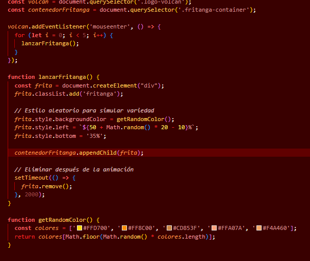
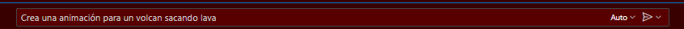
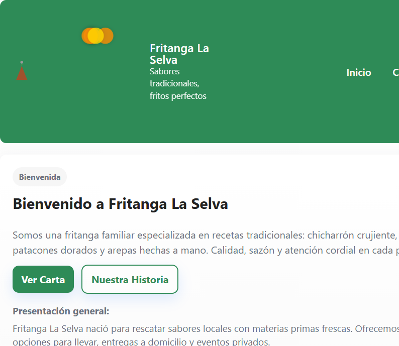

# Fritanga Selva

## 🎯 Propósito del Sitio

Este sitio web tiene como objetivo presentar y tener una manera más accesible y presentable a una fritanguera para poder vender sus productos y presentar su ubicación para que los clientes puedan llegar de manera más sencilla. 
Desarrollado como parte del proyecto del segundo corte de la clase Plataformas de colaboración digital, busca que los clientes ya existentes o potenciales puedan obtener información acerca del local más facilmente.

Características principales:
- ✅ [Característica 1, ej: "Diseño responsive adaptado a todos los dispositivos"]
- ✅ [Característica 2, ej: "Interfaz intuitiva y fácil de usar"]
- ✅ [Característica 3, ej: "Optimizado para rendimiento y accesibilidad"]
- ✅ [Característica 4, ej: "Código mantenible y bien documentado"]

👥 Roles de los Integrantes

Integrante 1: Raúl Valverde
- Rol Principal: Desarrollador Frontend, Líder de Proyecto
- Responsabilidades:
  - Desarrollo de la estructura HTML principal
  - Implementación de estilos CSS y diseño responsive
  - Integración de componentes JavaScript
  - Gestión del repositorio Git y documentación

Integrante 2: Kellys Bellanger
- Rol Principal: Desarrollador Frontend, encaragdo de la pagina de menú.
- Responsabilidades:
  - Lista de tareas específicas, ej: "Diseño de la base de datos" para poder escoger del menu al momentod e hacer un pedido
  - Realizar la interfaz funcional para la pagina dedicada al menú.

Integrante 3: Jesser Rodriguez
- Rol Principal: Desarrollador de la pagina de contacto y pedido.
- Responsabilidades:
Pruebas de funcionalidad y usabilidad
  Creación y revisión de contenido
  Optimización
Integrante 4: Erick Arana
- Rol Principal: Desarrollador Frontend, encaragdo de la pagina de historia y sobre eel negocio.
- Responsabilidades:
  - Lista de información persuasiva e inspiratoria para la pagina de historia.
  - Realizar la interfaz funcional para la pagina de "sobre nosotros" o "acerca de".
Integrante 5: Jimmy Selva
- Rol Principal: Desarrollador Frontend, encaragdo de la pagina de ubicación y horarios.
- Responsabilidades:
  - Lista de información actualizada en tiempo real para los horarios y la disponibilidad de los dias feriados.
  - Realizar la interfaz funcional para la la carga de ubicacion digital con funciones de google maps u otro navegador al igual qeu escribir la dirección.

 Uso de GitHub Copilot

Cómo Implementamos GitHub Copilot

GitHub Copilot fue una herramienta fundamental en nuestro flujo de desarrollo, utilizada de las siguientes maneras:

Generación de Código Eficiente
- Estructuras HTML: Creación rápida de componentes repetitivos
- Estilos CSS: Sugerencias para layouts responsive y efectos visuales
- Lógica JavaScript: Ayuda en funciones complejas y manejo de eventos

Ejemplos Concretos de Uso
Al pedirle que creara animaciones no las comprendia muy bien y las generaba con errores



Como se puede ver en la tercer imagen la "lava" sale a un lado del volcan y no del volcan

```html
<!-- Solicitud a Copilot: "crea un navbar con logo y 5 enlaces" -->
<nav class="navbar">
    <div class="nav-logo">
        
    </div>
    <ul class="nav-links">
        <li><a href="#inicio">Inicio</a></li>
        <li><a href="#servicios">Servicios</a></li>
        <!-- ... más enlaces generados por Copilot -->
    </ul>
</nav>
```
Ya listos para publicar la pagina pedimos ayuda de los paso a paso de como hacerlo a copilot

le enviamos esa imagen con el siguietne prompt y su respuesta fue:

completandolo con exito.
Link de la pagina publicada: https://raul-valverde.github.io/PCD_WEB_RKJJE/
